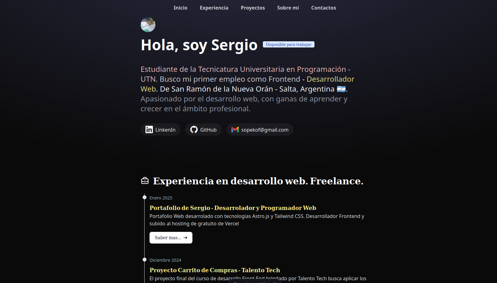

# 🧑‍💻 Mi Portafolio Web 💻

<div align="center">
<a href="https://portafolio-web-tl1w.vercel.app/">

</a>
<p></p>
</div>

<div align="center">


<div align="center">

[**Live Demo**](https://portafolio-web-tl1w.vercel.app/)

</div>

---

## ✨ Características

- 🌐 **Multi-idioma**: Español, Inglés y Portugués
- ⚡ **Rendimiento**: Construido con Astro para máxima velocidad
- 📱 **Responsivo**: Diseño adaptable a todos los dispositivos
- 🎨 **Tailwind CSS**: Estilos modernos y mantenibles
- 📄 **TypeScript**: Tipado estático para mayor seguridad
- 🚀 **Despliegue rápido**: Deploy automático en Vercel

---

## 🛠️ Tech Stack

| Categoría  | Tecnología     |
| ---------- | -------------- |
| Framework  | Astro          |
| Estilos    | Tailwind CSS   |
| Lenguaje   | TypeScript     |
| Runtime    | Bun            |
| Deployment | Vercel         |
| Fuentes    | Onest Variable |

---

## 🚀 Instalación Local

1. **Clona el repositorio:**

   ```bash
   git clone https://github.com/SASOPELANA/Portafolio-Web.git
   cd Portafolio-Web
   ```

2. **Instala las dependencias:**

   ```bash
   bun install
   ```

3. **Ejecuta el servidor de desarrollo:**

   ```bash
   bun run dev
   ```

4. **Abre tu navegador:**
   - El proyecto estará disponible en `http://localhost:4321`

---

## 📁 Estructura del Proyecto

| Carpeta       | Descripción                          |
| ------------- | ------------------------------------ |
| `assets/`     | Imágenes, fuentes e iconos           |
| `components/` | Componentes reutilizables (+ icons/) |
| `data/`       | Datos de proyectos y experiencia     |
| `i18n/`       | Traducciones (ES, EN, PT-BR)         |
| `layouts/`    | Layouts principales                  |
| `pages/`      | Páginas del sitio (multi-idioma)     |
| `styles/`     | Estilos globales                     |
| `types/`      | Tipos TypeScript                     |

---

## 📝 Licencia

Este proyecto está bajo la licencia MIT.

---

## 📬 Contacto

<div align="center">

[](https://github.com/SASOPELANA)
[](https://www.linkedin.com/in/sergio-sopelana-devs)
[](mailto:sopekof@gmail.com)

</div>

</div>
